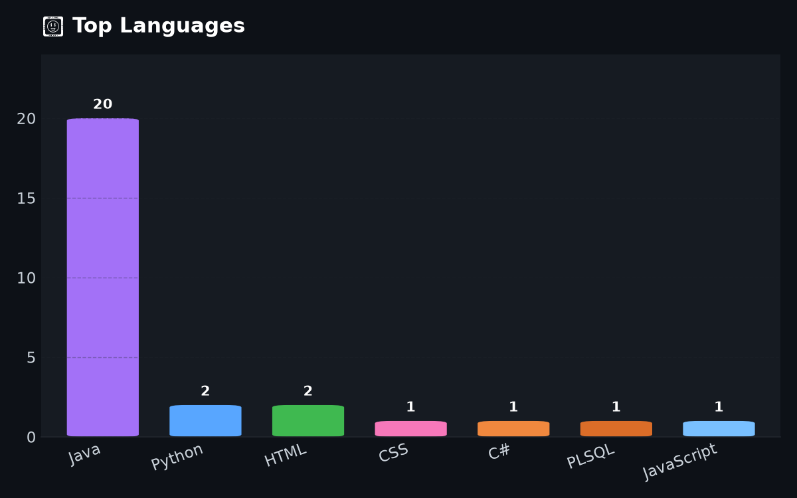
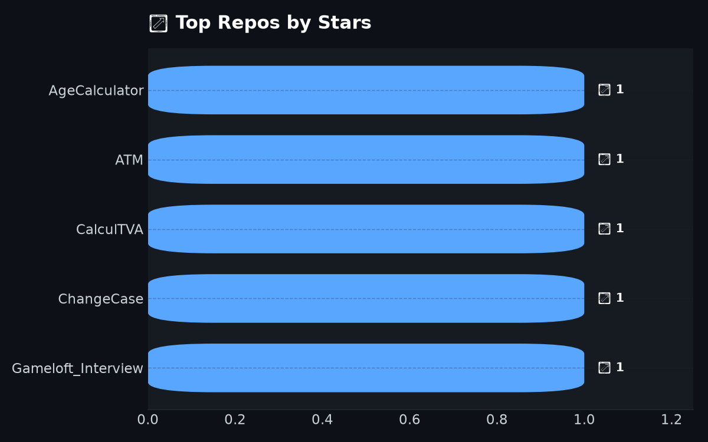
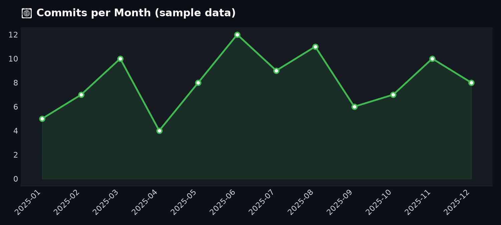

# 👋 Hey, I'm Andreea

💻 Software Engineer / SQL Developer · 🏦 Banking Regulatory Reporting · 📍 Bucharest, Romania

---

## 🚀 About Me

- 💡 I work with **Java, SQL & Python** on banking-adjacent and internal enterprise projects
- 🖥️ I build full-stack web apps — Flask/SQL Server backends with SPA frontends, plus C#/Entity Framework/Angular
- 🌐 Recently deep in **RPA & test automation** — UiPath, Power Automate, and Cypress/TypeScript E2E suites
- 📊 Background in banking regulatory reporting: FINREP, COREP, LCR, NSFR, ALMM
- 📈 Comfortable with Power BI for reporting/dashboards
- ⚡ I prefer clean, simple code with no unnecessary complexity — and Romanian-first UI/comments in my own projects

---

## 🧰 Tech Stack

  

**Also:** SQL Server · Oracle PL/SQL · Power BI · UiPath · Power Automate

---

## 📊 GitHub Stats

  
  

  

  

> 🔄 Graficele de mai sus sunt generate automat de <code>generate_stats.py</code> — actualizează-le local sau printr-un GitHub Action ca să rămână la zi.

---

## 📈 Activity Graph

  

---

## 🏆 Achievements

  

---

## 🚀 Featured Projects

### 🔵 NBD Forum *(Full-Stack Web App)*
- 🔹 Internal communication & event-management platform, grown into a full SPA with admin panel
- 🔹 **Flask + SQL Server** backend, real-time messaging (SSE), calendar with notifications, GDPR data export
- 🔹 Moderator role system, user management, personalized post-login dashboard with widgets & followed categories
- 🔹 12 new HTML email notification templates (dark navy style) with a two-level admin selector — recently shipped
- 🔹 Extensive **Cypress E2E test suite**: registration, login, navigation, calendar, GDPR, security (XSS/SQLi), chat
> 🔒 Private repository — internal / personal project

### 📋 Contacte Companii — Asistent de căutare job
- 🔹 Aplicație web **Node.js + Express + MySQL** pentru gestionarea contactelor HR pe parcursul căutării unui job
- 🔹 Adaugi contacte HR (companie, email, domeniu, comentariu), editabile/ștergibile oricând
- 🔹 Trimiți email către unul sau mai multe contacte deodată, pentru o poziție anume, opțional legată de un job salvat
- 🔹 **Notificări automate** cu clopoțel și counter de necitite, când primești răspuns de la un contact salvat
- 🔹 Salvezi profilul LinkedIn al fiecărui contact
- 🔹 Status rapid per contact — *Email trimis / Mesaj LinkedIn trimis / A răspuns* — cu istoric complet (timeline) al acțiunilor
- 🔹 Modul de **Joburi & Aplicații**: link, titlu, companie, status (Găsit → Aplicat → Interviu → Respins/Ofertă), dată aplicare
> 🔒 Private repository — personal project

### 🕒 NBD Pontaj *(Timesheet & HR Tracking App)*
- 🔹 Standalone **Flask + SQL Server** app, built with the same architectural patterns as NBD Forum but its own independent schema & authentication
- 🔹 **Modulul Pontaj** — evidența orelor lucrate zilnic per angajat
- 🔹 **Modulul Concedii** — gestionarea cererilor și evidența zilelor de concediu
- 🔹 **Modulul Prezența birou** — tracking prezență fizică la birou vs. remote
> 🔒 Private repository

### 🛒 Smart Price Market *(Price & Receipt Tracking Web App)*
- 🔹 Flask + SQL Server app for tracking grocery receipts, stores & purchases over time
- 🔹 Full **CRUD pentru bonuri (receipts) și magazine (stores)**, cu management dinamic al magazinelor
- 🔹 Widget de dashboard cu cumpărăturile săptămânale
- 🔹 Originally built as a **JavaFX desktop app**, later migrated to a Flask web stack
> 🔒 Private repository

### 🔒 Data Processing Tool
- 🔹 Advanced **data processing & price comparison** tool
- 🔹 Detects differences between datasets / reporting periods
- 🔹 Built with **Java & SQL**, inspired by real-world banking workflows
> 🔒 Private repository — internal / personal project

---

## ⭐ Other Projects

- 🔹 **LinkAcademy-Project** *(Java)* — final application project, tied to my LinkAcademy Java Developer certification
- 🔹 **Calculator Apps** *(JavaFX)* — multiple UI implementations
- 🔹 **JavaApplicationsUdemy** *(Java)* — practice & exercises
- 🔹 **webDevApplicationsGood** *(JavaScript)* — web experiments
- 🔹 **Calculator_GUI** *(Python)* — recent project

---

## 🌐 Connect with me

  

---

## ✨ Dev Quote

> *"Keep it simple. SQL clean, logic clear."* 💙
